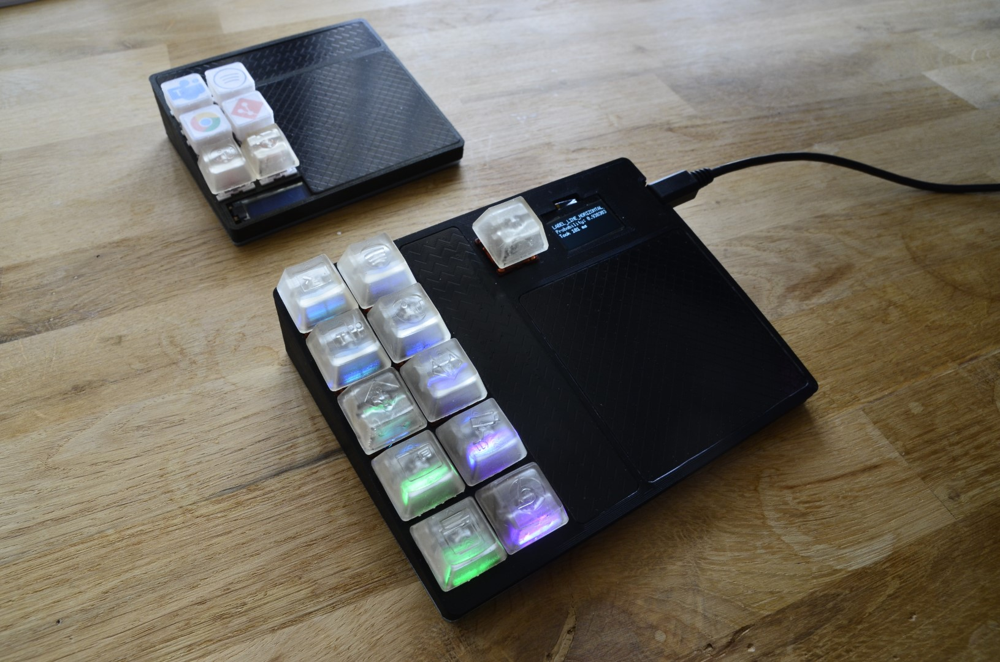
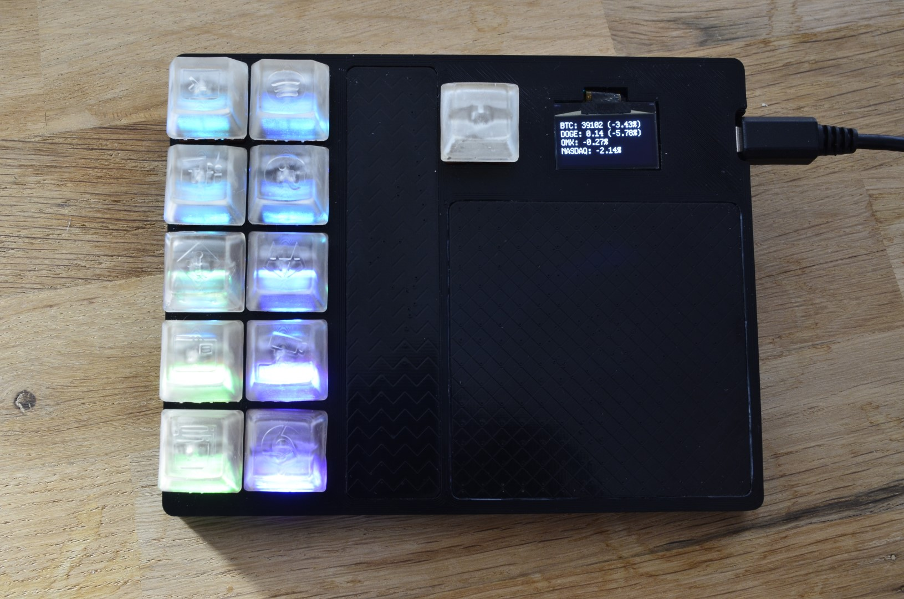
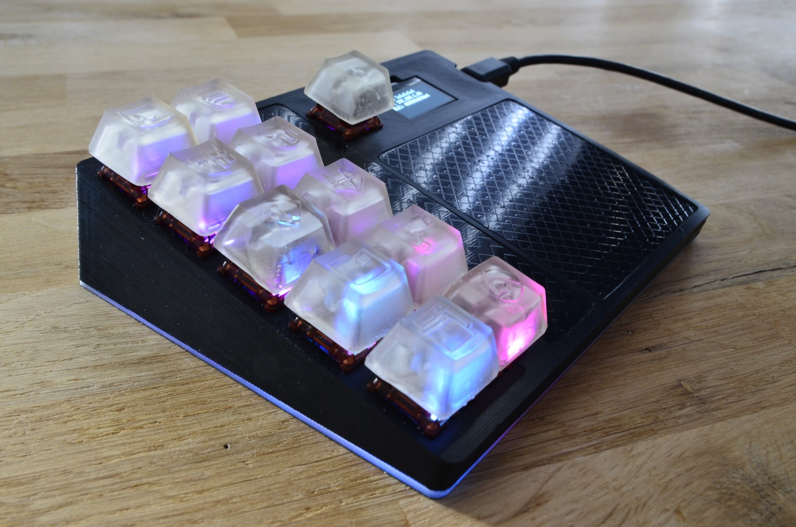
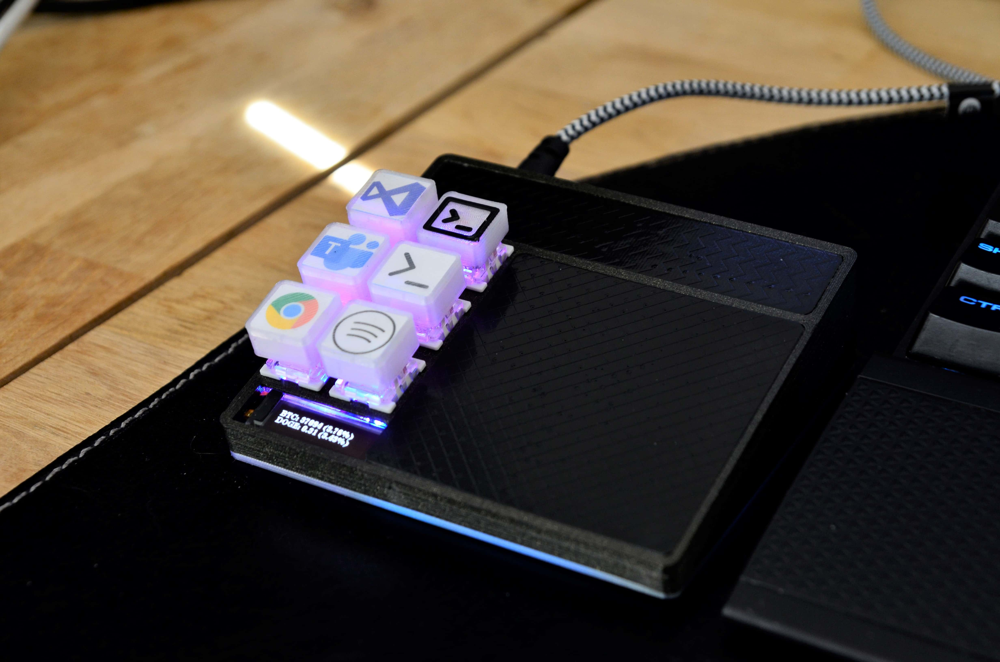
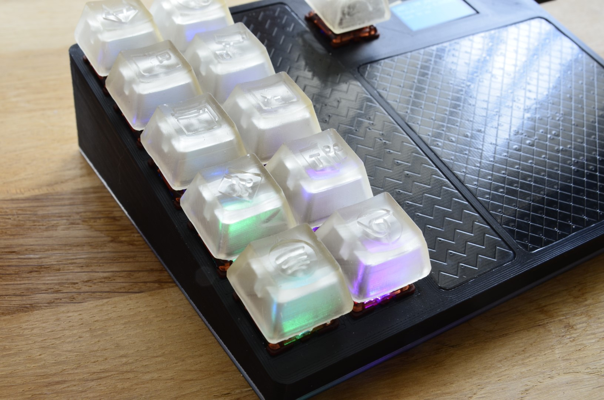
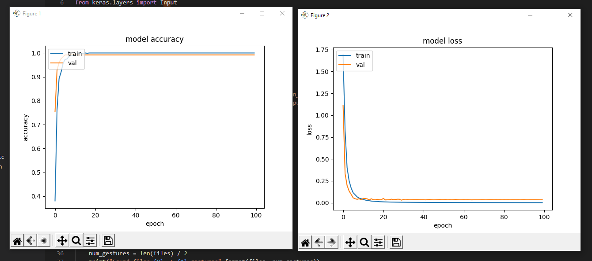

# Gesture detection
tldr; Glorified Bluetooth macro keyboard with machine learning (TensorFlow Lite for Microcontrollers) running on an ESP32.
## Main features
- Capacitive touch pad for drawing gestures on that maps to actions on the computer.
- Capacitive touch bar for volume control.
- 11 Buttons for generic control.
- Optional AutoHotkey for programatical control exactly what shall happen when keys are pressed or a gesture is drawn.
- Small OLED display for various info such as crypto prices, remote Bluetooth status, local IP and gesture prediction debug info.
- BLE HID to connect to a computer and act as a keyboard.
- Such very RGB.

  
  

### How it works
The switch presses and the touchpad gestures will end up being sent as a keyboard shortcut. This CAN be enough for some use cases, but it gets really powerful when coupled together with something AutoHotkey scripts running on the computer.

**Current AutoHotkey script works as following**

On the computer focus one window and then hold down one of SWITCH_1-10 for 2s. This will connect this key to that specific window. When clicking the key it will focus window if not in focus, and if in focus minimize it.

**Gestures are mapped as following**
| Gesture        | Action | How to remember
| ------------- |:-------------|:-------------| 
|ARROW_RIGHT | Media key next track | > as in next
|ARROW_UP | git push current branch | ʌ as in away/push
|C_GESTURE | Display all the COM ports on the computer as a notification | 'C' as in COM Port
|LINE_DOWN_GESTURE | git log | 'l' as in log
|LINE_HORIZONTAL_GESTURE | git diff | 
|S_GESTURE | git status | 'S' as in status
|ARROW_DOWN | git fetch and git pull current branch | 'V' as in pull
|... | whatever | ...

Note the commands involving git above will also focus the git terminal window before executing the action. For this to work SWITCH_2 is expected to be mapped with a git terminal window. For more detailed info about the actions look in 
[`hotkeys/hotkey_handler.ahk`](hotkeys/hotkey_handler.ahk)

#### SWITCH_11
Is special key and used for enable Bluetooth pairing (hold down for 5s) and moving through the different "menus" on the OLED screen.

## Compiling ESP32 code
Follow instruction on [https://github.com/espressif/esp-idf](https://github.com/espressif/esp-idf) to set up the esp-idf, then just run `idf.py build` or use the [VSCode extension](https://github.com/espressif/vscode-esp-idf-extension). Tested with esp-idf 4.2.

## Tensorflow gesture/shape detection
Tensorflow Lite is used to recognize what is being drawn on the touchpad. There are already some shapes/gestures training data collected by me and is found in the `/training/train_data` folder and a pre trained model using those is what is being used by default. The trackpad outputs x, y coordinates in the range [0,1792], coordinates collected between touch start and touch release are then converted into a 28x28 2D matrix which is used as input to TensorFlow.

**Example how simple it is to add a new gesture**

[Higher res video here](https://youtu.be/cg1-SUCJ2Vs)

### Gather train data
First you need to enter training mode on the macro keybord by holding down SWITCH_11 while plugging in power. In training mode the device pretty much just pipes the raw data from the trackpad over UART as a string with this format: `[x1, y1, x2, y2,...]\n`. Then go to the  `/training` folder. For each new gesture `collect_train_data.py` needs to run twice, first to collect train data and then to collect test data. For current number of gestures (7) about 150 train samples and about 45 test samples seems to be enough to get very good predictions.

    python collect_train_data.py --port COMX --gesture_name v_shape
    python collect_train_data.py --port COMX --gesture_name v_shape --test_data

After each drawn gesture a plot of the input data will be shown, if it looks bad because you made a misstake, then just press ENTER in the console and the last sample will be removed from the data. Press `ctrl+c` when done.

### Training the model
When collection of data is finished run `python train_model.py --center_gesture` it will take about 30s depending on computer. It will pick up all train data in the `train_data` folder, so remove any data for unwanted gestures. This script will generate a `gesture_model_tflite.c` and `gesture_model_tflite.h` files containing the TF Lite model that can be imported by embedded TF Lite. The `gesture_model_tflite.h` file is also generated from the Python code and contains various information such as the map between predictions (int) and their meaning, if `--center_gesture` was used when training, etc. All output from the `train_model.py` will be put in a folder `training/output`. When compiling the embedded code the generated `.c` and `.h` files are automatically copied into the C code directory so latest model will always be compiled.

#### `--center_gesture`
Option to center the gesture in the input matrix, this will help when the training data is drawn at a specific location on the trackpad, but you want it to be recognized anywhere. This option will remove functionality to have for example two line down gestures, one at the right side and one at the left side of the trackpad as this option will move both gestures to the center. For this to work the same change is needed on target before inputing the drawn gesture to the embedded model. This is handled automatically as this is added into the `gesture_model_tflite.h` file and handled accordingly in embedded code.

**Study the graphs to see how well the model performed on test data.**

### Testing/verifying the model
Before moving the model into the microcontroller it's a good idea to test it first. First make sure the device is in training mode as described before, then test the model by running `python test_model.py --port COMX --center_gesture` and watch the predictions show as you draw on the trackpad.

## AutoHotkey setup
- Install Auto Hotkey from https://www.autohotkey.com/
- Right click on the `hotkeys/hotkey_handler.ahk` -> compile
- Now you will get an .exe file, right click on this and create a shortcut
- To auto start with Windows type `Windows key + r`
- Run `shell:startup` and paste the `hotkey_handler.exe - Shortcut` into the opened folder.
- Done

## CAD model
Full Fusion 360 project is found in `CAD` folder.

## Trill sensors
Bought from their Kickstarter in 2019, but can be bought today from [here now](https://bela.io/products/trill/)
